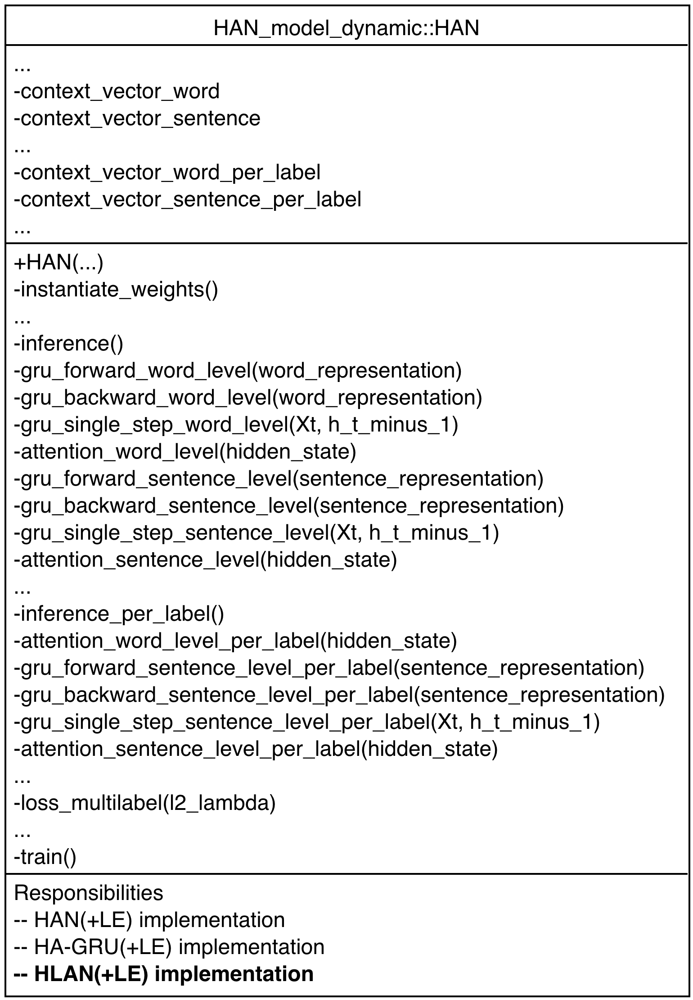
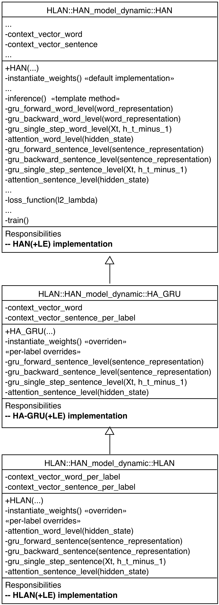
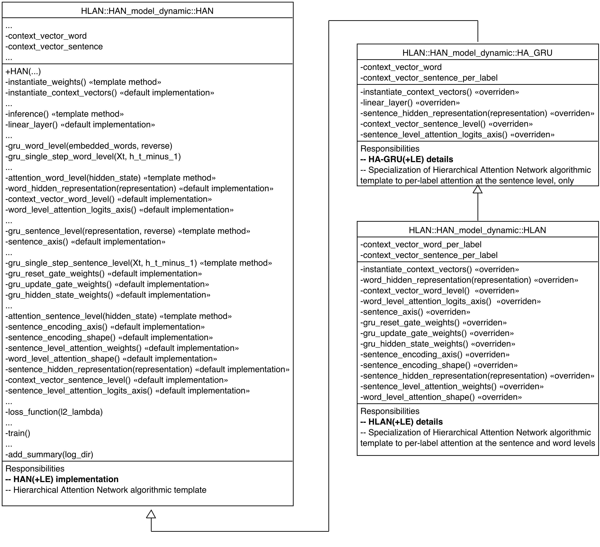

# CS598DL4H
Project for CS 598 Deep Learning for Healthcare

## Local Setup

### Submodules

```sh
git submodule init
git submodule update
```

### Virtual Environments

#### CS598DL4h

```sh
pyenv local 3.7.11
python3.7 -m venv env
env/bin/pip install --upgrade pip
env/bin/pip install -r requirements.txt -r dev-requirements.txt
```

Use `env/bin/python` as the kernel for [MIMIC_III.ipynb](./MIMIC_III.ipynb).

#### caml-mimic

```sh
pyenv local 3.7.11
python3.7 -m venv env
env/bin/pip install --upgrade pip
env/bin/pip install -r requirements.txt
```

Use `caml-mimic/env/bin/python` as the kernel for [caml-mimic/notebooks/dataproc_mimic_III.ipynb](caml-mimic/notebooks/dataproc_mimic_III.ipynb).

#### Explainable-Automated-Medical-Coding

```sh
pyenv local 3.7.11
python3.7 -m venv env
env/bin/pip install --upgrade pip
env/bin/pip install -r requirements.txt
```

Use `Explainable-Automated-Medical-Coding/env/bin/python` as the kernel for [Explainable-Automated-Medical-Coding/HLAN/demo_HLAN_viz.ipynb](Explainable-Automated-Medical-Coding/HLAN/demo_HLAN_viz.ipynb).

## Google Colab Setup

See [Setup.ipynb](./Setup.ipynb) for Google Colab-only set up steps. Also, relevant Colab-only header sections in each notebook reference this set up.

## Repro Steps

### Prerequisites / Demo

[MIMIC_III.ipynb](./MIMIC_III.ipynb)

### Training

Examples detailed in [Explainable-Automated-Medical-Coding/README.md](./Explainable-Automated-Medical-Coding/README.md).

```sh
cd Explainable-Automated-Medical-Coding/HLAN/
source ../env/bin/activate
```

#### MIMIC-III Top 50

Currently working off of `Explainable-Automated-Medical-Coding/datasets/mimiciii_*_50_th0.txt`.

##### Original

```sh
cd Explainable-Automated-Medical-Coding/HLAN/
../env/bin/python HAN_train.py \
    --dataset mimic3-ds-50 \
    --batch_size 32 \
    --per_label_attention=True \
    --per_label_sent_only=False \
    --num_epochs 100 \
    --report_rand_pred=False \
    --running_times 1 \
    --early_stop_lr 0.00002 \
    --remove_ckpts_before_train=False \
    --use_label_embedding=True \
    --ckpt_dir ../checkpoints/checkpoint_HAN_50_per_label_bs32_LE/ \
    --use_sent_split_padded_version=False \
    --marking_id 50-hlan \
    --gpu=True  # Colab only
```

##### Clone

See `scripts` directory for operational parameters for `HLAN`, `HA-GRU` and `HAN` variants with and without label embedding (`LE`):
* `scripts/HLAN+LE.sh`
* `scripts/HA-GRU+LE.sh`
* `scripts/HAN+LE.sh`
* `scripts/HLAN.sh`
* `scripts/HA-GRU.sh`
* `scripts/HAN.sh`

#### MIMIC-III COVID-19 Shielding

> **NOTE:** this section is incomplete due to reproducibility challenges with the COVID-19 shielding data sourced from [UK's NHS](https://digital.nhs.uk/coronavirus/shielded-patient-list/methodology/annexes), and mapped from ICD-10 to ICD-9 using tools from [The Govt. of NZ](https://www.health.govt.nz/nz-health-statistics/data-references/mapping-tools/)

Needs preprocessing to extract only Admissions IDs from admissions containing COVID-19 related ICD-9 codes, derived from COVID-19 related ICD-10 codes in `./spl-icd10-opcs4-disease-groups-v2.0.csv` and from an ICD-10-to-ICD-9 mapping in `./masterb8.csv`. This process needs to generate `CSV` files akin to `caml-mimic/mimicdata/mimic3/*_50.csv` to be converted by `csv_to_text.py` to `Explainable-Automated-Medical-Coding/datasets/mimiciii_*_full_th_50_covid_shielding.txt`, the files the training expects.

##### Original

```sh
cd Explainable-Automated-Medical-Coding/HLAN/
../env/bin/python HAN_train.py \
    --dataset mimic3-ds-shielding-th50 \
    --batch_size 32 \
    --per_label_attention=True \
    --per_label_sent_only=False \
    --num_epochs 100 \
    --report_rand_pred=False \
    --running_times 1 \
    --early_stop_lr 0.00002 \
    --remove_ckpts_before_train=False \
    --use_label_embedding=True \
    --ckpt_dir ../checkpoints/checkpoint_HAN_shielding_per_label_bs32_LE/ \
    --use_sent_split_padded_version=False \
    --marking_id shielding-hlan \
    --gpu=True  # Colab only
```

## Code Changes

### Refactoring of HAN Class

* Original source: `Explainable-Automated-Medical-Coding/HLAN/HAN_model_dynamic.py`
* Refactored source: `HLAN/HAN_model_dynamic.py`

#### Original Class

The original class is a single implementation with the responsibility for HLAN
(Hierarchical Label-wise Attention Network), as well as both downgraded models,
HA-GRU (Hierarchical Attention - Gated Recurrent Unit) and HAN (Hierarchical
Attention Network). In addition, it handles the transparent application of Label
Embedding (LE) to each, by conditional application of a pre-trained word2vec model.



The important call out in this diagram is the number of instances `<method>` and
`<method>_per_label` pairs that exists, indicative of an imperitive implementation.
Concretely, where to apply label-wise attention (i.e.: attention *per label*) is
the primary difference between each of the model variants HAN, HA-GRU, and HLAN.

#### Replace Conditional with Polymorphism

The first refactoring was [Replace Conditional with Polymorphism][polymorphism].
This allowed all the instances of `<method>` and `<method>_per_label` pairs to be
modeled, instead, with an inheritence hierarchy from the simplest model (HAN, which
applies no label-wise attention) to the most complex (HLAN, which applies label-wise
attention at the sentence and word level).

[polymorphism]: https://refactoring.com/catalog/replaceConditionalWithPolymorphism.html



#### Form Template Method

The second refactoring applied was [Form Template Method][form]. This allowed a
great deal of duplication to be effectively removed by making many more finer-grained
methods than the original class supported. With this change, commonality among
methods defined by more than one class became apparent, and all common methods
could be pushed up the inheritence hierarchy as a [Template Method][template].

[form]: https://www.industriallogic.com/xp/refactoring/formTemplateMethod.html
[template]: https://en.wikipedia.org/wiki/Template_method_pattern



#### Deduplication Results

Both refactorings allowed approximately a 40% redunction in Lines of Code, and 75%
reduction in words, for a functionally equivalent implementation, as shown.

##### Lines

```sh
$ wc -l Explainable-Automated-Medical-Coding/HLAN/HAN_model_dynamic.py
    1193 Explainable-Automated-Medical-Coding/HLAN/HAN_model_dynamic.py
$ wc -l HLAN/HAN_model_dynamic.py
     698 HLAN/HAN_model_dynamic.py
```

##### Words
```sh
$ wc -w Explainable-Automated-Medical-Coding/HLAN/HAN_model_dynamic.py
    6577 Explainable-Automated-Medical-Coding/HLAN/HAN_model_dynamic.py
$ wc -w HLAN/HAN_model_dynamic.py
    1678 HLAN/HAN_model_dynamic.py
```